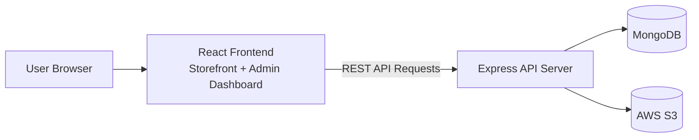
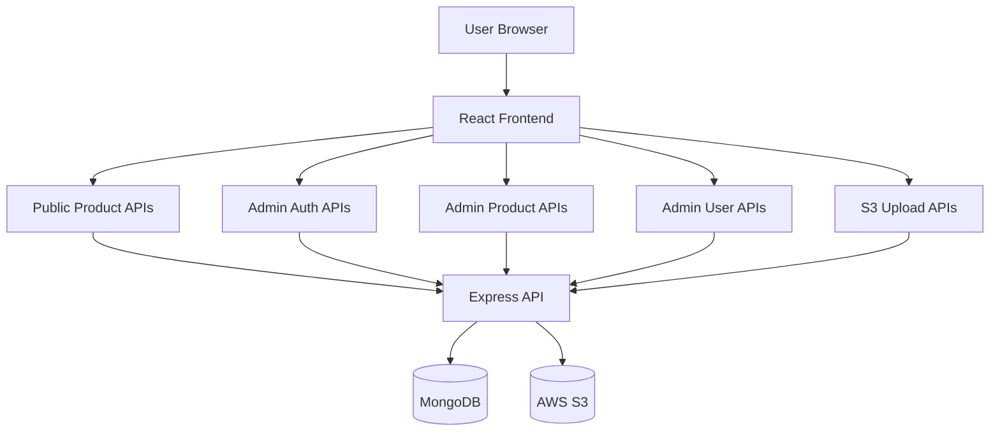
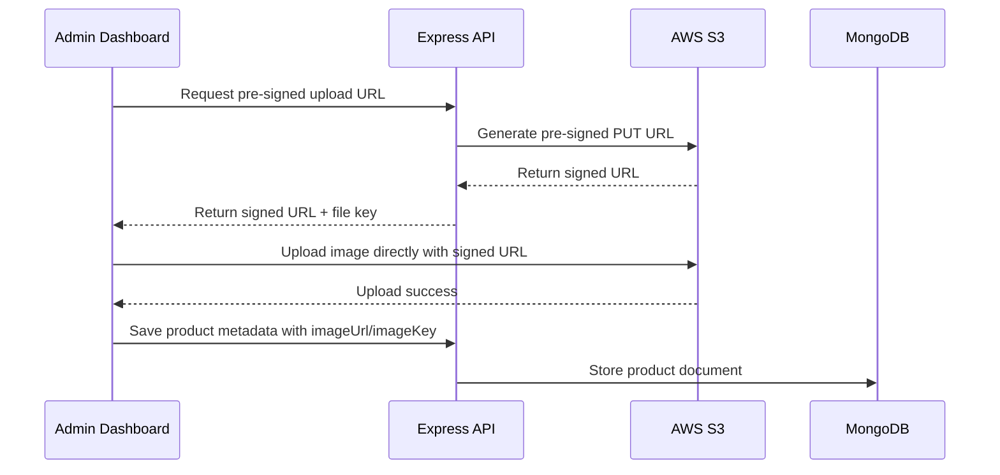
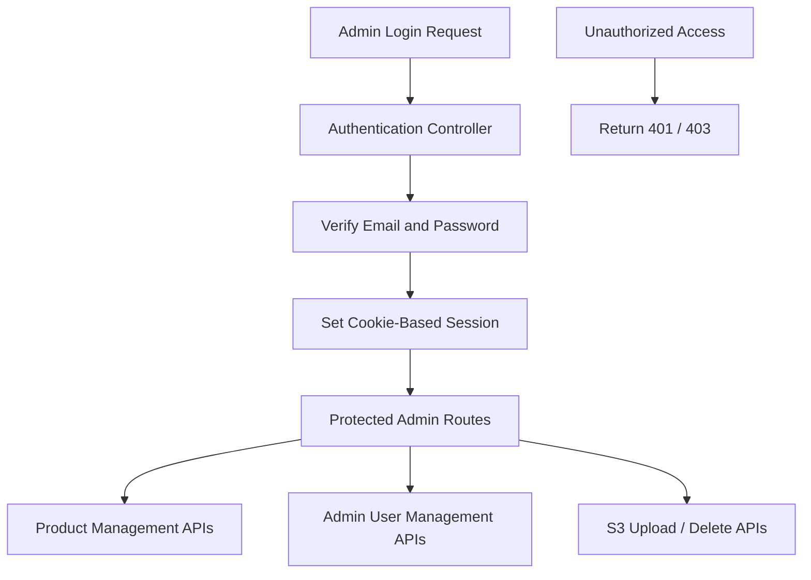
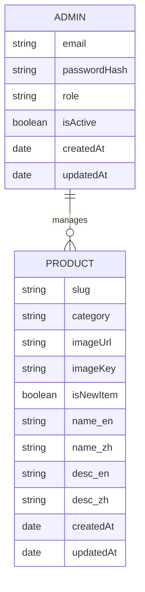

# Bristar E-commerce Platform


Modern **full-stack e-commerce platform** built with React, Node.js, Express, MongoDB, and AWS S3.

This project demonstrates a production-style architecture with a React storefront, an admin dashboard, and a RESTful backend API for managing products, users, and image uploads.

---

# Table of Contents

- [Preview](#preview)
- [Features](#features)
- [Tech Stack](#tech-stack)
- [System Architecture](#system-architecture)
- [API Architecture](#api-architecture)
- [AWS S3 Upload Flow](#aws-s3-upload-flow)
- [Admin Auth Security](#admin-auth-security)
- [Database Schema](#database-schema)
- [API Endpoints](#api-endpoints)
- [Project Structure](#project-structure)
- [Installation](#installation)
- [Author](#author)

---

# Preview

Below are quick demonstrations of the admin dashboard and storefront.

## Storefront


## Admin Dashboard


---

# Features

## Customer Interface

- Browse product catalog
- Category filtering
- Product detail pages
- Responsive storefront
- Multi-language support (EN / ZH)

## Admin Dashboard

- Admin authentication
- Create / update / delete products
- Product image upload
- Role-based admin access
- Admin user management

## Backend API

- RESTful API architecture
- MongoDB schema design with Mongoose
- AWS S3 pre-signed upload workflow
- Secure cookie-based authentication
- Role-based admin authorization

---

# Tech Stack

## Frontend

- React
- Vite
- JavaScript
- Tailwind CSS
- i18n (English / Chinese)

## Backend

- Node.js
- Express
- MongoDB
- Mongoose

## Cloud

- AWS S3 (image storage)

---

# System Architecture


---

# API Architecture


---

# AWS S3 Upload Flow



---

# Admin Auth Security



---

# Database Schema


---

# API Endpoints

## Public APIs

GET /api/products  
GET /api/products/categories  

---

## Admin Authentication

POST /api/admin/auth/login  
POST /api/admin/auth/logout  
GET /api/admin/auth/me  

---

## Admin Product Management

GET /api/admin/products  
POST /api/admin/products  
PUT /api/admin/products/:id  
DELETE /api/admin/products/:id  

---

## Admin User Management

GET /api/admin/users  
POST /api/admin/users  
PUT /api/admin/users/:id  
DELETE /api/admin/users/:id  

---

## AWS S3 Image APIs

POST /api/admin/s3/presign-put  
POST /api/admin/s3/delete  

---

# Project Structure

```
bristar
│
├── react-app
│   ├── src
│   │   ├── assets
│   │   ├── components
│   │   ├── data
│   │   ├── i18n
│   │   ├── pages
│   │   │   └── admin
│   │   ├── services
│   │   ├── App.jsx
│   │   └── main.jsx
│
├── server
│   ├── src
│   │   ├── controllers
│   │   ├── middlewares
│   │   ├── models
│   │   ├── routes
│   │   ├── scripts
│   │   └── index.js
│
└── demo
    ├── user-demo.gif
    └── admin-demo.gif
```

---

# Installation

Follow these steps to run the project locally.

## 1. Clone the repository

```bash
git clone https://github.com/Shengyi-Zhang/bristar.git
cd bristar
```

## 2. Install frontend dependencies
```bash
cd react-app  
npm install
```

## 3. Install backend dependencies
```bash
cd ../server  
npm install
```
## 4. Configure environment variables

Create `.env` inside `/server`
```env
PORT=5000

MONGODB_URI=your_mongodb_uri

JWT_SECRET=your_jwt_secret
JWT_EXPIRES_IN=7d

AWS_REGION=your_bucket_region
AWS_ACCESS_KEY_ID=your_key  
AWS_SECRET_ACCESS_KEY=your_secret  
S3_BUCKET=your_bucket
```

## 5. Run backend server
```bash
cd server
npm run dev
```

## 6. Run frontend application

Open a new terminal and run:
```bash
cd react-app
npm run dev
```

---

# Author

Shengyi Zhang  
Full Stack Developer

React · Node.js · Express · MongoDB · AWS S3
